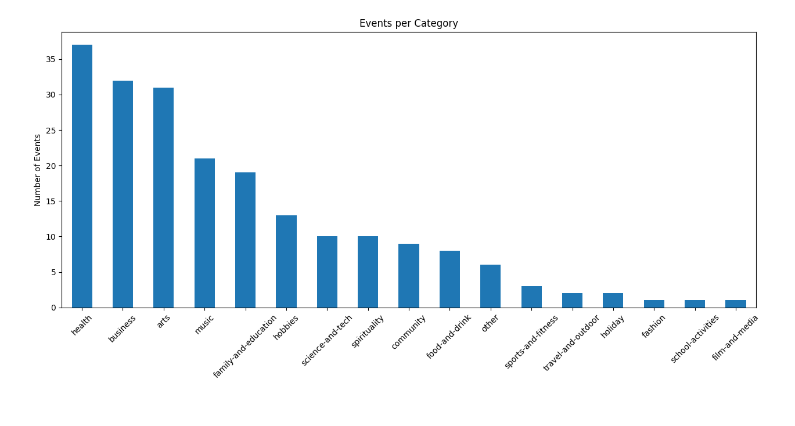
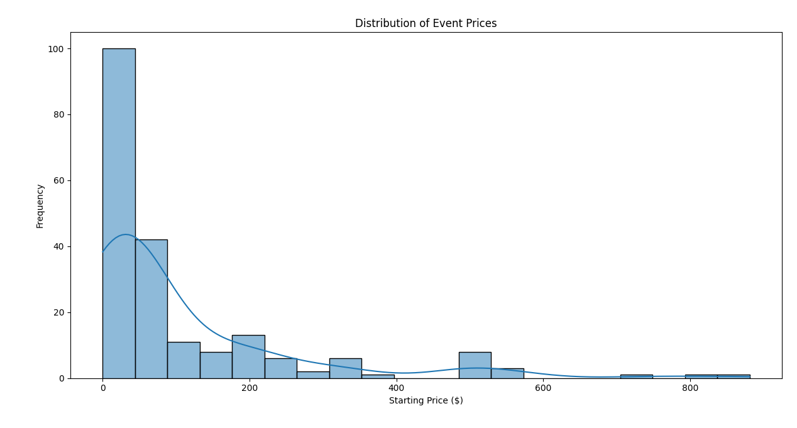

# Eventbrite Scraper

A complete web scraping tool that captures event data from [Eventbrite Singapore](https://www.eventbrite.com/d/singapore--singapore/all-events/).

> Eventbrite is a popular platform hosting various types of events including concerts, workshops, meetups, and seminars.

It is designed to handle dynamic JavaScript-rendered content using Selenium and outputs the data in structured CSV and JSON formats.

The scraper was built using **Python** and **Selenium**, with a headless Chrome browser for dynamic rendering support. It includes pagination support, modular architecture, and options for easy future extensions.

## Project Structure

```
.
├── scraper.py                              # Main script to orchestrate scraping flow
├── utils/
│   ├── helpers.py                          # Utility functions: event parsing and data export
│   └── constants.py                        # CSS selectors, keywords, config
├── data/
│   ├── eventbrite.csv                      # Extracted data in CSV format
│   └── eventbrite.json                     # Extracted data in JSON format
├── diagrams/
│   ├── event-category-distribution.png     # Bar chart of event categories
│   └── event-prices-distribution.png       # Histogram of event prices
└──requirements.txt                         # Python package dependencies
```

## Setup

### Prerequisites

Before you begin, make sure the following are installed on your system:

- Python 3.8+
- Google Chrome (required for Selenium to launch a headless browser and render JavaScript content)

### Clone the repository

```bash
git clone https://github.com/gowthaman-01/eventbrite-scraper.git
cd eventbrite-scraper
```

### Install dependencies

```bash
python -m venv venv
source venv/bin/activate  # On Windows: venv\\Scripts\\activate
pip install -r requirements.txt
```

### Run the scraper

You can specify how many pages to scrape with the --pages flag. If no arguments are provided, the scraper will default to 10 pages:

```bash
python scraper.py --pages 5
```

## Scraping Workflow

1. Launch a headless Chrome browser.
2. Visit Eventbrite’s Singapore listings for pages 1 to 10.
3. For each page, wait for full render and extract all event cards.
4. Parse each card and save event data into:
   - `data/eventbrite.csv`
   - `data/eventbrite.json`

### Data Fields Extracted

Each event in the output files contains the following fields:

| Field       | Description                                        |
| ----------- | -------------------------------------------------- |
| Title       | Name of the event                                  |
| URL         | Direct link to the event page                      |
| Location    | Physical location or city                          |
| Paid Status | 'paid' or 'free'                                   |
| Category    | Event category (e.g., music, arts, business)       |
| Urgency     | Status text like “Sales end soon” or “Almost full” |
| Date & Time | Human-readable event time string                   |
| Price       | Ticket price range or minimum                      |
| Host        | Organizer or venue                                 |

## Implementation Details

The project was structured with clarity and modularity in mind. The `scraper.py` script serves as the entry point, orchestrating the page navigation, data collection, and export process. All CSS selectors, urgency keywords, and output paths were centralized in `constants.py` for easy maintenance. The logic for parsing each event card and exporting the results was encapsulated in `helpers.py`.

### Dynamic Content Handling

Eventbrite loads some of its card details (`title` and `p` tags) dynamically via JavaScript. To extract content reliably, the scraper uses:

```python
driver.execute_script("return arguments[0].innerText;", element)
```

This approach retrieves the visible text post-render, bypassing limitations of `.text` or `.get_attribute()`.

### Pagination

The scraper uses formatted URLs with the `?page={n}` query parameter, allowing it to iterate over multiple pages:

```python
for page in range(1, 11):
    url = EVENTBRITE_BASE_URL.format(page=page)
```

### Anti-Scraping Defense

To prevent overloading Eventbrite’s servers and avoid bot detection:

- Each page is fetched with a `WAIT_TIME = 3` seconds delay
- Headless browser is used to simulate human browsing
- No aggressive concurrency or request spoofing is employed

## Insights





- Over 200 unique events captured
- Most common categories: music, arts, business, health
- Prices range from $0.00 (free) to $300+
- Several events are marked with urgency tags, indicating high demand

## Limitations

- Some events may have missing `urgency` or `host` fields due to inconsistent HTML
- Titles are used to deduplicate events; if Eventbrite reuses titles, some records may be skipped
